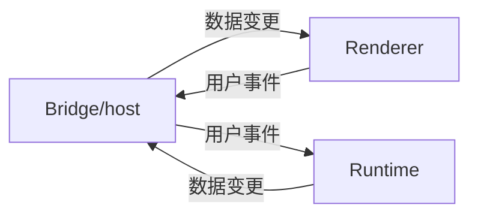
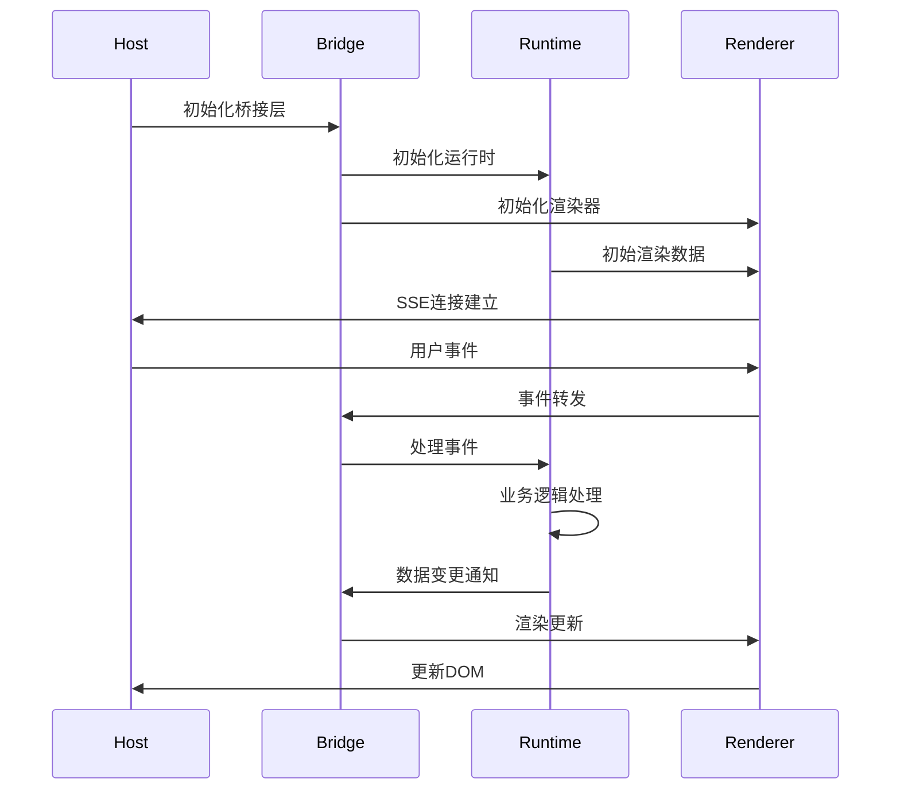

# 小程序底层原理

## Hybrid技术：Web与原生的融合

Hybrid技术本质上是Web技术（HTML/CSS/JS）与原生应用（Native）特性的深度结合。在微信小程序中，这种结合表现为：

- 渲染层：使用Webview技术进行页面渲染，实现丰富的交互和页面效果。
- 逻辑层：依托原生应用提供的数据处理与业务逻辑能力，确保运行效率与稳定性。
- 原生层：提供原生能力,中转渲染层与逻辑层事件消息。

在正常web中，js代码是会阻塞页面渲染的，这在一定程度上影响了页面在感官上的响应速度。而微信小程序采用双线程模型，即渲染层线程与逻辑层线程独立运行，通过原生层中转，和jianjie既保留了Web技术的灵活性，又发挥了原生应用的性能优势，后面各大厂商推出的小程序也基本采取这一方式。

## 小程序运行容器demo

### 概述

基于小程序的基本原理，使用node作为原生层，使用v8引擎单独执行js代码作为运行时沙箱，并使用浏览器作为渲染层，复刻一个简单的小程序运行容器。

### 架构层级

- **宿主层（Host）**：(`src/host.js`) — 提供宿主环境、事件总线、以及与浏览器/页面的桥接接口。
- **桥接层（Bridge）**：(`src/bridge.js`) — 负责消息传递、序列化/反序列化、RPC 风格调用与调用回调管理。
- **运行层（Runtime）**：(`src/runtime.js`) — 创建沙盒环境，解释并执行小程序逻辑（`app.js` 等），管理小程序生命周期（初始化、页面切换、销毁）。
- **渲染层（Renderer）**：(`src/renderer.js`) — 将小程序的标记（`app.axml`）和样式（`app.axss`）转换为浏览器 DOM/CSS，处理数据绑定与更新，这里简化了流程，

### 关键文件职责速览

- [public/index.html](public/index.html)：宿主页面入口，加载脚本并提供运行环境（DOM、样式容器）。
- [sample-app/app.js](sample-app/app.js)：小程序业务代码（事件处理、数据、页面逻辑）。
- [sample-app/app.axml](sample-app/app.axml)：小程序结构模板（自定义标记）。
- [sample-app/app.axss](sample-app/app.axss)：小程序样式表。

### 执行顺序（启动到首屏渲染

1. 浏览器加载 `public/index.html`，并注入宿主脚本与资源。
2. 宿主脚本（`src/host.js`）初始化宿主环境：创建全局上下文、事件总线、并准备运行时配置（沙箱、权限镜像等）。
3. 桥接层（`src/bridge.js`）初始化，建立宿主与运行时之间的消息通道（可能是基于事件的回调队列或 postMessage 模拟）。
4. 运行层（`src/runtime.js`）加载并解析小程序脚本（`sample-app/app.js`）、模板（`sample-app/app.axml`）与样式（`sample-app/app.axss`）。
5. 运行层向渲染层发送初始渲染请求，包含模板 AST 或数据快照。
6. 渲染层（`src/renderer.js`）将模板映射为 DOM 节点，应用样式，并绑定事件回调（事件回调会通过 `bridge` 回传到 `runtime` 或 `host`）。
7. 首屏渲染完成后，用户交互（如点击、输入）产生事件：事件由渲染层捕获并通过 `bridge.js` 转发到 `runtime.js`，由小程序逻辑处理并可能触发数据变更。
8. 数据变更后，`runtime.js` 通知 `renderer.js` 做差分更新，`renderer.js` 只更新变更节点以提高性能。

### 调用/消息流（简化序列）

- 启动：`public/index.html` → `host` 初始化 → `bridge` 建立 → `runtime` 加载脚本 → `renderer` 渲染。
- 事件：用户事件 (DOM) → `renderer` 捕获 → `bridge` 转发 → `runtime` 执行业务 → `runtime` 更新数据 → `bridge`/`renderer` 更新视图。

### 流程图（Mermaid）

