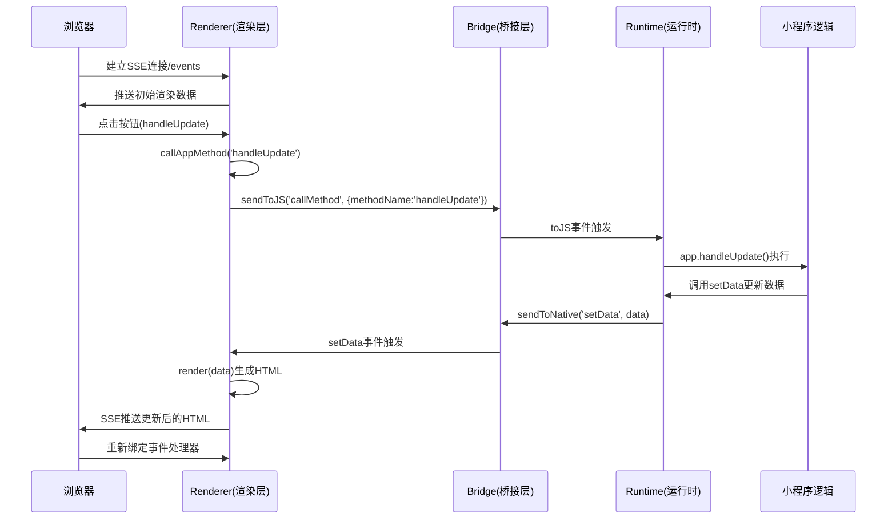

# 小程序底层原理

## Hybrid技术：Web与原生的融合

Hybrid技术本质上是Web技术（HTML/CSS/JS）与原生应用（Native）特性的深度结合。在微信小程序中，这种结合表现为：

- 渲染层：使用Webview技术进行页面渲染，实现丰富的交互和页面效果。
- 逻辑层：依托原生应用提供的数据处理与业务逻辑能力，确保运行效率与稳定性。
- 原生层：提供原生能力,中转渲染层与逻辑层事件消息。

在正常web中，js代码是会阻塞页面渲染的，这在一定程度上影响了页面在感官上的响应速度。而微信小程序采用双线程模型，即渲染层线程与逻辑层线程独立运行，通过原生层中转，和jianjie既保留了Web技术的灵活性，又发挥了原生应用的性能优势，后面各大厂商推出的小程序也基本采取这一方式。

## 小程序运行容器demo

### 概述

基于小程序的基本原理，使用node作为原生层，使用v8引擎单独执行js代码作为运行时沙箱，并使用浏览器作为渲染层，复刻一个简单的小程序运行容器。

### 架构层级

- **宿主层（Host）**：(`src/host.js`) — 提供宿主环境、事件总线、以及与浏览器/页面的桥接接口。
- **桥接层（Bridge）**：(`src/bridge.js`) — 负责消息传递、序列化/反序列化、RPC 风格调用与调用回调管理。
- **运行层（Runtime）**：(`src/runtime.js`) — 创建沙盒环境，解释并执行小程序逻辑（`app.js` 等），管理小程序生命周期（初始化、页面切换、销毁）。
- **渲染层（Renderer）**：(`src/renderer.js`) — 借助htmlparser2将小程序的（`app.axml`）和样式（`app.axss`）转换为AST，在处理为浏览器的 DOM/CSS，处理数据绑定与更新，这里做了简单实现，只处理了一些简单指令。

### 关键文件职责速览

- [public/index.html](public/index.html)：宿主页面入口，加载脚本并提供运行环境（DOM、样式容器）。
- [sample-app/app.js](sample-app/app.js)：小程序业务代码。
- [sample-app/app.axml](sample-app/app.axml)：小程序结构模板。
- [sample-app/app.axss](sample-app/app.axss)：小程序样式表。

### 核心代码实现详解

#### 1. Bridge桥接层实现

```javascript
// src/bridge.js
const EventEmitter = require('events');

class Bridge extends EventEmitter {
  constructor() {
    super();
  }

  // 从 JS 发送到 Native（宿主/渲染层）
  sendToNative(cmd, payload) {
    this.emit(cmd, payload);
  }

  // 从 Native 发送到 JS
  sendToJS(cmd, payload) {
    this.emit('toJS', { cmd, payload });
  }
}

module.exports = Bridge;
```

**核心原理**：

- 继承EventEmitter实现事件驱动的消息传递
- `sendToNative`: 逻辑层向渲染层发送数据变更通知
- `sendToJS`: 渲染层向逻辑层发送用户事件和方法调用请求

#### 2. Runtime运行时实现

```javascript
// src/runtime.js (关键部分)
class Runtime {
  constructor(bridge) {
    this.bridge = bridge;
    this.app = null; // 存储App实例
  }

  run(filePath) {
    const code = fs.readFileSync(filePath, 'utf8');
    const runtime = this;

    const sandbox = {
      // 提供小程序API
      setData: (data) => {
        if (runtime.bridge && typeof runtime.bridge.sendToNative === 'function') {
          runtime.bridge.sendToNative('setData', data);
        }
      },
      // App构造函数 类似与支付宝小程序中的Page构造函数，承载生命周期，涉及页面更新的数据和方法
      App: function(appDef) {
        runtime.app = appDef || {};
        // 触发onLaunch生命周期
        if (typeof runtime.app.onLaunch === 'function') {
          runtime.app.onLaunch.call(runtime.app);
        }
      },
      console: sandboxConsole,
      setTimeout, clearTimeout, setInterval, clearInterval
    };

    vm.createContext(sandbox);
    vm.runInContext(`(function(){\n${code}\n})();`, sandbox);
  }

  // 触发生命周期方法
  triggerLifecycle(name, ...args) {
    if (this.app && typeof this.app[name] === 'function') {
      this.app[name].apply(this.app, args);
    }
  }
}
```

**核心原理**：

- 使用Node.js `vm`模块创建安全沙箱执行环境
- 注入小程序核心API（如`setData`、`App`）
- 管理小程序生命周期和数据状态

#### 3. Renderer渲染器实现

```javascript
// src/renderer.js (关键部分)
class Renderer {
  constructor(port = 3000) {
    this.clients = new Set(); // SSE客户端连接
    this.currentData = null;  // 当前数据状态
    this._startServer();
  }

  // HTTP服务器处理各种路由
  _startServer() {
    const server = http.createServer((req, res) => {
      // SSE连接处理
      if (req.url === '/events') {
        res.writeHead(200, {
          'Content-Type': 'text/event-stream',
          'Cache-Control': 'no-cache',
          Connection: 'keep-alive',
        });
        res.write('retry: 10000\n\n');
        this.clients.add(res);
        
        // 新连接时发送当前数据
        if (this.currentData) {
          const html = this._renderTemplate(this.template, this.currentData);
          const payload = JSON.stringify({ html, data: this.currentData });
          res.write(`data: ${payload}\n\n`);
        }
        req.on('close', () => this.clients.delete(res));
      }

      // 方法调用API
      if (req.url === '/api/callMethod' && req.method === 'POST') {
        let body = '';
        req.on('data', chunk => body += chunk.toString());
        req.on('end', () => {
          try {
            const requestData = JSON.parse(body);
            // 通过bridge转发方法调用
            if (this.bridge && typeof this.bridge.sendToJS === 'function') {
              this.bridge.sendToJS('callMethod', requestData);
              res.writeHead(200, { 'Content-Type': 'application/json' });
              res.end(JSON.stringify({ success: true }));
            }
          } catch (error) {
            res.writeHead(400).end(JSON.stringify({ error: 'Invalid request' }));
          }
        });
      }
    });
  }

  // 渲染数据并推送到客户端
  render(data) {
    this.currentData = data;
    const html = this._renderTemplate(this.template, data || {});
    const payload = JSON.stringify({ html, data });

    // 推送到所有连接的客户端
    for (const res of this.clients) {
      try {
        res.write(`data: ${payload}\n\n`);
      } catch (e) {
        this.clients.delete(res);
      }
    }
  }
}
```

**核心原理**：

- 使用Server-Sent Events(SSE) 接受服务端的实时页面更新
- 监听dom元素事件通过http请求转发回服务端处理

#### 4. 宿主层协调实现

```javascript
// src/host.js
const Bridge = require('./bridge');
const Runtime = require('./runtime');
const Renderer = require('./renderer');

const bridge = new Bridge();
const renderer = new Renderer(3002);
const runtime = new Runtime(bridge);

// 建立各层间通信
renderer.setBridge(bridge);

// 数据变更处理
bridge.on('setData', (payload) => {
  renderer.render(payload);
  runtime.triggerLifecycle('onUpdate', { data: payload });
});

// 方法调用处理
bridge.on('toJS', (payload) => {
  if (payload.cmd === 'callMethod') {
    const { methodName, args } = payload.payload;
    // 调用App对象中的对应方法
    if (runtime.app && typeof runtime.app[methodName] === 'function') {
      runtime.app[methodName].call(runtime.app, args);
    }
  }
});

// 启动运行
runtime.run(path.join(__dirname, '..', 'sample-app', 'app.js'));
// 基于默认data启动首次渲染
runderer.render(runtime.app.data);
```

#### 5. 前端事件处理

```html
<!-- public/index.html -->
<script>
  // 建立SSE连接
  const es = new EventSource('/events');
  
  // 方法调用函数
  window.callAppMethod = async function(methodName, args = {}) {
    const response = await fetch('/api/callMethod', {
      method: 'POST',
      headers: { 'Content-Type': 'application/json' },
      body: JSON.stringify({ methodName, args })
    });
  };

  // 动态绑定事件处理器
  function bindEvents() {
    const buttons = document.querySelectorAll('button[onclick]');
    buttons.forEach(button => {
      const onclickAttr = button.getAttribute('onclick');
      if (onclickAttr) {
        const methodName = onclickAttr.replace(/\(.*\)$/, '').trim();
        button.onclick = function(e) {
          e.preventDefault();
          window.callAppMethod(methodName);
        };
      }
    });
  }

  // SSE消息处理
  es.onmessage = (e) => {
    const obj = JSON.parse(e.data);
    if (obj.html) {
      document.getElementById('render').innerHTML = obj.html;
      setTimeout(bindEvents, 10); // 重新绑定事件
    }
  };
</script>
```

### 执行顺序（启动到首屏渲染）

1. 浏览器加载 `public/index.html`，并注入宿主脚本与资源。
2. 宿主脚本（`src/host.js`）初始化宿主环境：创建全局上下文、事件总线、并准备运行时配置（沙箱、权限镜像等）。
3. 桥接层（`src/bridge.js`）初始化，建立宿主与运行时之间的消息通道（可能是基于事件的回调队列或 postMessage 模拟）。
4. 运行层（`src/runtime.js`）加载并解析小程序脚本（`sample-app/app.js`）、模板（`sample-app/app.axml`）与样式（`sample-app/app.axss`）。
5. 运行层向渲染层发送初始渲染请求，包含模板 AST 或数据快照。
6. 渲染层（`src/renderer.js`）将模板映射为 DOM 节点，应用样式，并绑定事件回调（事件回调会通过 `bridge` 回传到 `runtime` 或 `host`）。
7. 首屏渲染完成后，用户交互（如点击、输入）产生事件：事件由渲染层捕获并通过 `bridge.js` 转发到 `runtime.js`，由小程序逻辑处理并可能触发数据变更。
8. 数据变更后，`runtime.js` 通知 `renderer.js` 做差分更新，`renderer.js` 只更新变更节点以提高性能。

### 调用/消息流（简化序列）

- 启动：`public/index.html` → `host` 初始化 → `bridge` 建立 → `runtime` 加载脚本 → `renderer` 渲染。
- 事件：用户事件 (DOM) → `renderer` 捕获 → `bridge` 转发 → `runtime` 执行业务 → `runtime` 更新数据 → `bridge`/`renderer` 更新视图。

### 完整的消息流转图



### 技术要点总结

1. **双线程架构模拟**：通过Node.js主线程(RunTime)和浏览器渲染线程(Renderer)实现逻辑与渲染分离
2. **沙箱安全执行**：使用vm模块创建隔离的JavaScript执行环境
3. **实时通信机制**：基于SSE实现服务端向浏览器的实时数据推送
4. **事件驱动架构**：通过EventEmitter实现各层间的松耦合通信
5. **模板解析渲染**：简易的WXML模板解析器实现数据绑定和指令处理

### 当前实现的功能特性

✅ 小程序App对象注册和简单生命周期管理  
✅ setData数据更新机制  
✅ 模板数据绑定和渲染  
✅ 用户事件处理和方法调用  
✅ 实时数据推送(SSE)  
✅ 控制台日志转发  
✅ 基础指令支持(if/for)

